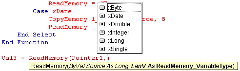



## ReadMemory function \(Behind The Pointer\)

### Description

A discussion (article) and implementation (code module) of an easy-to-use, general-purpose-yet-fast raw memory reading function.
 
### More Info
 
What data you want to read, and into what type of variable ( = data length).

Contains full 5-page article documenting function. If you don't want to read it, then just plug in the provided Module, use InitRM at the beginning of your code and you're ready to go. :)

Data.

Try to get someone else's RAM, you GPF. (If an API gives you a pointer, then that area becomes yours.)

             |
---                |---
**Submitted On**   |2005-05-22 11:04:08
**By**             |[Merlyn Rees](https://github.com/Planet-Source-Code/PSCIndex/blob/master/ByAuthor/merlyn-rees.md)
**Level**          |Intermediate
**User Rating**    |5.0 (20 globes from 4 users)
**Compatibility**  |VB 3\.0, VB 4\.0 \(16\-bit\), VB 4\.0 \(32\-bit\), VB 5\.0, VB 6\.0, VBA MS Access, VBA MS Excel
**Category**       |[VB function enhancement](https://github.com/Planet-Source-Code/PSCIndex/blob/master/ByCategory/vb-function-enhancement__1-25.md)
**World**          |[Visual Basic](https://github.com/Planet-Source-Code/PSCIndex/blob/master/ByWorld/visual-basic.md)
**Archive File**   |[ReadMemory1899856112005\.zip](https://github.com/Planet-Source-Code/merlyn-rees-readmemory-function-behind-the-pointer__1-61053/archive/master.zip)

